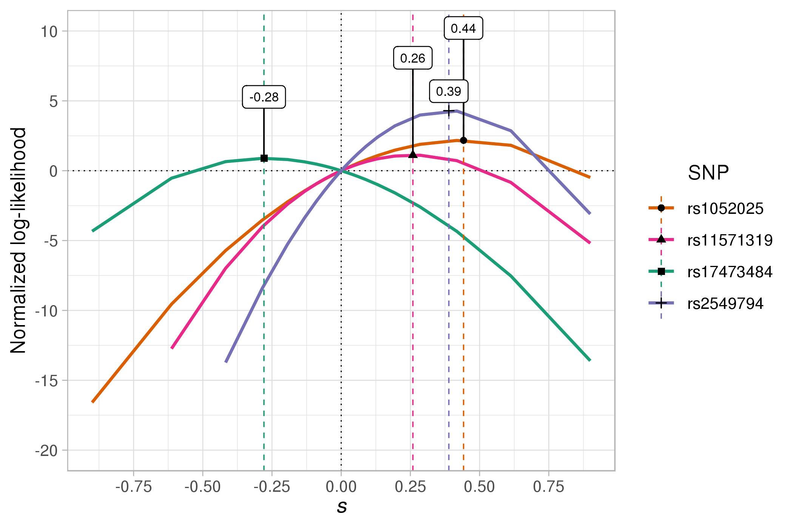
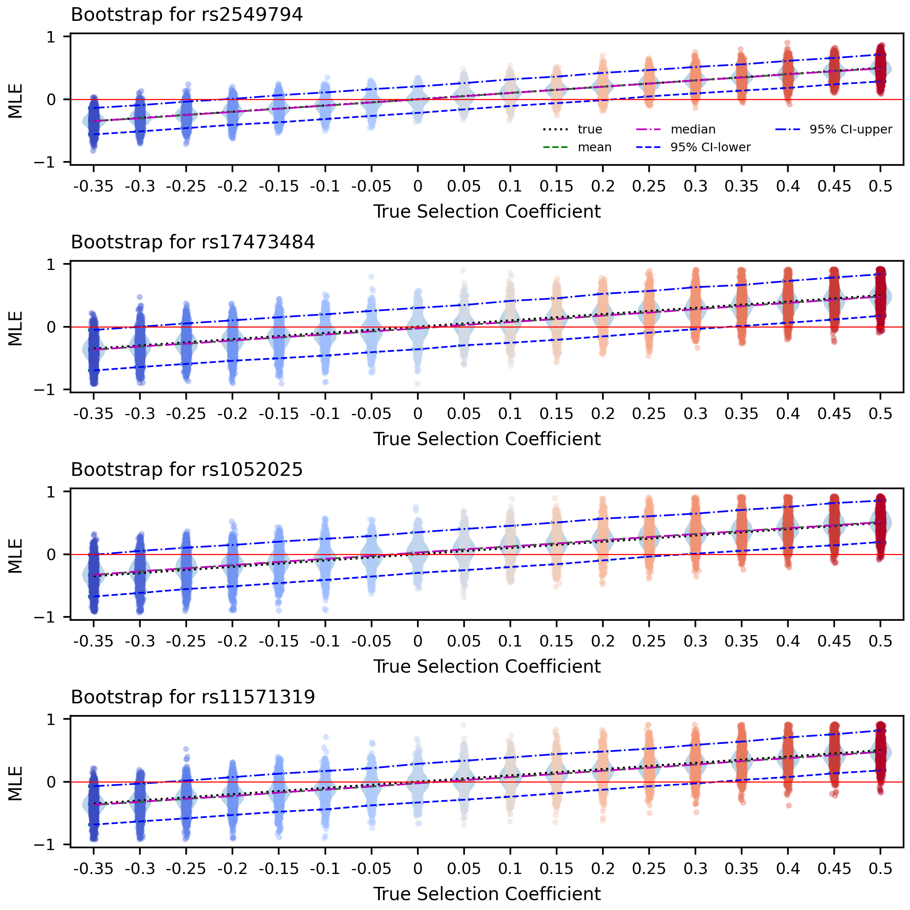
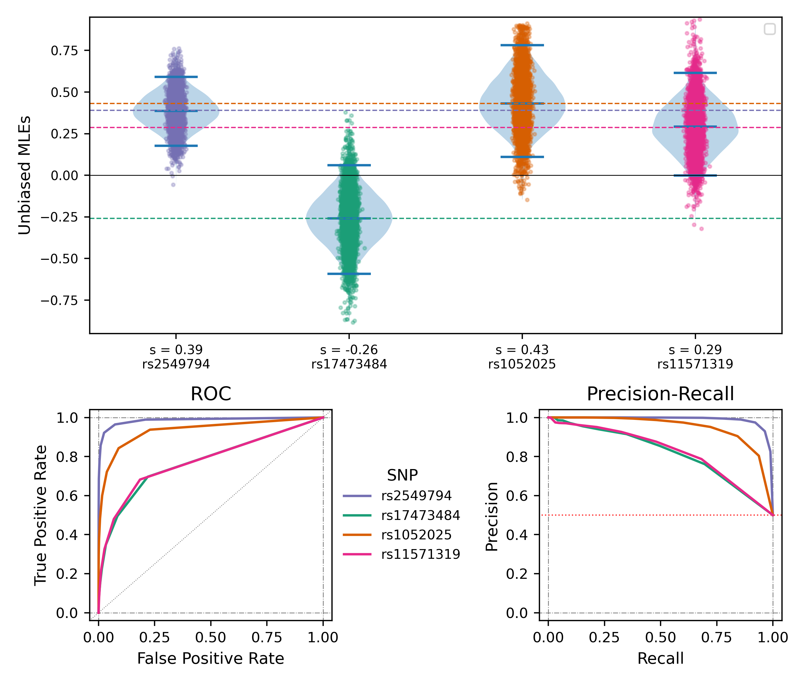

This repository hosts scripts used to obtain and replicate estimates of confidence interval of the four SNP-of-interest in Klunk & Vigalys (2022). These loci are:
| chr | position (hg19) | rsID | relevant gene | estimated _s_ | bootstrap _s_ | 95\% CI | Emp. percentile* |
|:-----:|-----------------:| :----: | :------:| :----: | :---: | :---: | :--: | 
| 5 | 96,244,549 | rs2549794 | _ERAP1_/2 | 0.39 | 0.40 | (0.19, 0.62) | 0* | 
| 5 | 114,915,460 | rs17473484 | _TICAM2_/_TMED7_ | -0.28 | -0.26 | (-0.59, 0.06) | 3.63 x 10<sup>-3</sup> |
| 18 | 77,287,776 | rs1052025 | _NFATC1_ | 0.44 | 0.43 | (0.11, 0.77) | 9.55 x 10<sup>-5</sup> |
| 2 | 204,738,938 | rs11571319 | _CTLA4_ | 0.26 | 0.29 | (-0.0012, 0.61) | 2.10 x 10<sup>-3</sup> |

<details>
  <summary>*:</summary>
  
  See details about obtaining empirical percentile at "Note" in part 3.1.
</details>


## 0. Environment set-up

Scripts in this repository are written and tested in a unix environment and should be able to work in unix/macOS and Windows WSL with proper set up. To download/clone this repository and the linked submodule, use commands:

```shell
git clone https://github.com/steinrue/black_death_analysis.git
cd black_death_analysis/
git submodule update --init --recursive
```

<details>
  <summary>See more about the dependencies of Python (>=3.8) and R here.</summary>

### 0.1. Python 

  The scripts are developed and tested with Python 3.8.5 and should (in theory) work with all python 3.8 and above. Packages required are `numpy`, `scipy`, `pandas`, and `matplotlib`. The user can run:
  ```shell
  pip install -r requirements.txt
  ```
  
### 0.2. R
The small R script `plot_LLcurves.r` requires packages `data.table`, `ggplot2`, `ggrepel`, and `ggpubr`. For reference, below is the sessionInfo() of the development environment:
  <details>
    <summary>sessionInfo()</summary>

```
R version 3.5.0 (2018-04-23)
Platform: x86_64-pc-linux-gnu (64-bit)
Running under: Red Hat Enterprise Linux Server release 6.7 (Santiago)

Matrix products: default
BLAS: /gpfs/apps/haswell/software/gcc-6.2.0/R/3.5.0/lib64/R/lib/libRblas.so
LAPACK: /gpfs/apps/haswell/software/gcc-6.2.0/R/3.5.0/lib64/R/lib/libRlapack.so

locale:
 [1] LC_CTYPE=en_US.UTF-8       LC_NUMERIC=C
 [3] LC_TIME=en_US.UTF-8        LC_COLLATE=en_US.UTF-8
 [5] LC_MONETARY=en_US.UTF-8    LC_MESSAGES=en_US.UTF-8
 [7] LC_PAPER=en_US.UTF-8       LC_NAME=C
 [9] LC_ADDRESS=C               LC_TELEPHONE=C
[11] LC_MEASUREMENT=en_US.UTF-8 LC_IDENTIFICATION=C

attached base packages:
[1] stats     graphics  grDevices utils     datasets  methods   base

other attached packages:
[1] ggrepel_0.8.0     ggpubr_0.4.0      ggplot2_3.1.0     data.table_1.12.0
```
  </details>

</details>

## 1. Parsing genotype probabilities

To parse the genotype propbabilities of the samples, run the commands:

```shell
for loci in {neutral,gwas,exons}; do
  python GTprobs_to_counts_wFilter.py london $loci  
  python GTprobs_to_counts_wFilter.py denmark $loci
done
```
These commands will generate parsed text files in the working directory named `{POP}Samples_{LOCI}_filtered_WG.txt`. Note that the `.genolik` files are counting the reference alleles, therefore the parsed allele counts are for reference alleles too.

For the four candidate loci, we need to polarize their counts to derived alleles. Given that the reference alleles of SNPs `rs11571319` and `rs17473484` are ancestral, we can manually extract the candidate loci from the input and polarize them with the commands:
```shell
for pop in {london,denmark}; do
  cat ${pop}Samples_*_filtered_WG.txt | awk '($0 !~ /^#/)' | 
    awk '(NR == 1 || $2 == 96244549 || $2 == 114915460 || $2 == 77287776 || $2 == 204738938)' |
    awk 'BEGIN{OFS = "\t"}{
      if($2 == 114915460 || $2 == 204738938){
        print $1, $2, $4-$3, $4, $6-$5, $6, $8-$7, $8
      }else{ print $0 }
    }'> ${pop}_candidate_loci_derived_counts.txt
done
```
Here the two files are named in a way that starts with the population (`london` or `denmark`) that the loci were observed in; later scripts will take advantage of this. 

## 2. Computing log-likelihoods and maximum-likelihood estimate of selective coefficients

To compute log-likelihoods and MLEs of the selective coefficient of each candidate locus, assuming effective population size of 5000 for both populations, use the command:

```shell
python Compute_LLs_est_shat.py _candidate_loci_derived_counts.txt Candidates_derived --Ne 5e3,5e3
```
This script will generate two files with their respective log-likelihoods, `Candidates_derived_all_per-site.txt`, and max-likelihood point estimates of s_hat for each candidate SNP, written to `Candidates_derived_all_maxLLR.txt`.
  
In the same manner, to obtain the "empirical percentile", _i.e._ the quantile among neutral loci, of the combined log-likelihoods for candidate loci, one can run:

```shell
python Compute_LLs_est_shat.py Samples_neutral_filtered_WG.txt WG_neutral --Ne 5e3,5e3
```

Note that, although only the candidate loci are polarized, their max log-likelihood will not be changed by polarization because we assume a dominance of h=0.5. Therefore, one do not need to polarize all the neutral loci in order to make comparisons between the two sets.

With the pool of neutral likelihoods, the user should be able to obtain the percentiles based on the `MLR_all` column. Alternatively, we provide this small helper script `report_percentiles.py` for convenience, to which the user provide the output log-likelihood files of the target loci and neutral loci, respectively, that are generated from previous example commands. For example:

```shell
python report_percentiles.py Candidates_derived_all_maxLLR.txt WG_neutral_all_maxLLR.txt
```
<details>
  <summary>Note</summary>
  
  1. The "LLR" and "MLR" here are short for "log-likelihood ratio" and "maximum log-likelihood ratio" for each locus. These ratios are obtained by compairing the log-likelihood of the given _s_ to that of _s_=0, _i.e._ 2(LL[s] - LL[0]), for the locus considered. Because LL[0] is a constant for any given loci, maximizing the LLR is effectively the same as maximizing the likelihood.
  2. Because the quantiles are by default not corrected for multiple testing, when we interpret them as the "empirical percentile", they are also subject to multiple-testing issues.
</details>

We include a helper script to visualize the liklihood surface of these candidate SNPs. To replicate Fig. S4, given the outputs from previous commands, run:
```shell
Rscript plot_LLcurves.r Candidates_derived
```
[](images/Candidates_derived_LL_curves.png)

## 3. Estimating confidence intervals (CIs) from simulations
[](/images/schematics_newSkull.png)
### 3.1 Generating simulations and compute likelihoods
The script `Bootstrap_CIreps_simulation.py` will collect the samples at each of the four candidate loci, randomly re-sample with replacement as the initial condition, generate a given number of replicates based on the population genetic model we have for the two populations, compute their log-likelihoods and MLEs, write out the interpolated confidence intervals from these reps, and plot the. The user can use `-h` to check out the argument needed.
```shell
$ python Bootstrap_CIreps_simulation.py -h

usage: Bootstrap_CIreps_simulation.py [-h] [--Ne NES] [-H H] [--seed SEED] [--init INITIAL_SAMPLES] [--trueS2 TRUES2_STR]
                                      [--write_txt]
                                      NUM [NUM ...]
positional arguments:
  NUM                   Number of replicates.
optional arguments:
  -h, --help            show this help message and exit
  --Ne NES              Effective pop sizes of london and denmark, separated by comma.
  -H H                  Dominance Coefficient. Default is 0.5.
  --seed SEED
  --init INITIAL_SAMPLES
                        Path to .pkl file of initial samples.
  --trueS2 TRUES2_STR   List of alternative s2 values to simulate.
  --write_txt           Indicator for whether to write out text outputs of likelihoods for each scenario simulated.
                        Default is faulse.
```

By default, the simulating script will simulate each replicate locus independently evolving in two populations starting with initial condition of folded site frequency spectra or reference allele frequencies of the four candidate SNPs (so five conditions in total) at the first sampling time point in the respective population. Following each initial condition, each locus is simulated to undergo additive (_i.e._ dominance _h_=0.5) selection with _s_ = -0.35, -0.3, -0.25, -0.2, -0.15, -0.1, -0.05, 0, 0.05, 0.1, 0.15, 0.2, 0.25, 0.3, 0.35, 0.4, 0.45, or 0.5. For each combination of initial condition and true selective coeffitient, two text files will be written out: one with log-likelihoods computed on each grid point, another with interpolated maximum log-likelihood ratios (selection vs neutral) and the respective MLE of _s_ for each locus. All computed likelihoods will be saved in a binary pickle (`.pkl`) file unless `--write_txt` is used to write additional .txt outputs in the same format as `Compute_LLs_est_shat.py`. 

The following command will replicate Fig. S5 in the manuscript (see below). Text files with medians, means, and 95% confidence intervals interpolated at every 0.001 increment of true _s_ value are written to `sim1234_snp${i}-h0.5-bootStrapFreq_linear-interpolated_95CIs.txt`

```shell
python Bootstrap_CIreps_simulation.py 5000 --seed 1234 --Ne 5e3,5e3
```

[](images/sim314_h0.5-bootStrapFreq_Ne5e3-5e3_violins_linearIntpCI.png)

Note: this command will take 8.5hrs or longer to run due to the large number of replicates and the scenarios we consider. One can do smaller-scale test-runs to reach the same effect by reducing the number of replicates. 


### 3.2 Simulating the four target SNPs
Similarly, usage of the script `Simulate_target_SNPs.py` can also be found with `-h` argument.
```shell
$ python Simulate_target_SNPs.py -h

usage: Simulate_target_SNPs.py [-h] [--Ne NES] [-H H] [--seed SEED] --init INIT_FILE NUM [NUM ...] CIfile [CIfile ...]
positional arguments:
  NUM               Number of replicates.
  CIfile            Name of the interpolated CI file (with SFS in filename).
optional arguments:
  -h, --help        show this help message and exit
  --Ne NES          Effective pop sizes of london and denmark, separated by comma.
  -H H              Dominance Coefficient. Default is 0.5.
  --seed SEED
  --init INIT_FILE  Path to .pkl file of initial samples.
```

To replicate the Fig. S6 in the manuscript, use command:
```shell
python Simulate_target_SNPs.py 5000 sim1234_SFS-h0.5-bootStrapFreq_linear-interpolated_95CIs.txt --Ne 5e3,5e3 --seed 4321 --init Init_samples_for_targetSNPs.pkl
```
This script takes the pickled file with initial samples generated by the previous script (`Init_samples_for_targetSNPs.pkl`) to re-sample initial frequency, and simulates given number of replicates accordingly under s=0 or the "true" _s_ value in the interpolated file that has the closest median MLE to the MLE from the empirical data. It will compute likelihoods and generate MLEs for the simulated replicates, shift them by the same amount that previous s2_hat went through to obtain unbiased MLE for the target SNP, and plot the adjusted MLE distributions, ROC curves, and precision-recall curves for the four target SNPs.

Here, `sim1234_SFS-h0.5-bootStrapFreq_linear-interpolated_95CIs.txt` provides a reference to the names of the interpolated CI files. Note that it has to be `SFS` in the filename, and the `SFS` will be replaced with corresponding SNPs when finding "true" s values.

[](images/sim159_4SNPs-h0.5-bootStrapFreq_Ne5e3-5e3_tildeS2s_violins-ROC-presRecall.png)
